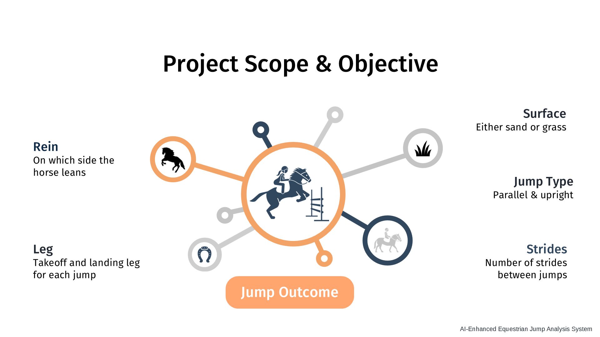
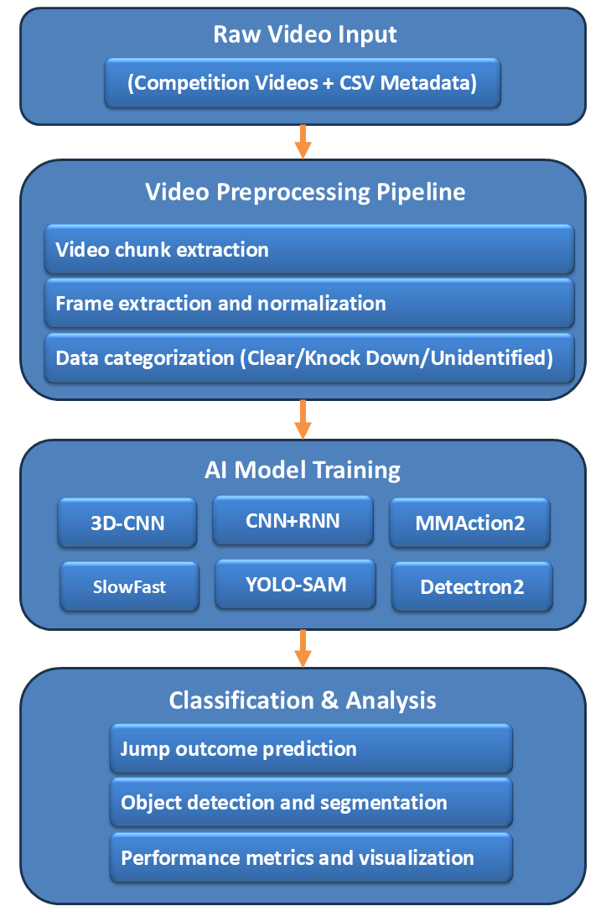
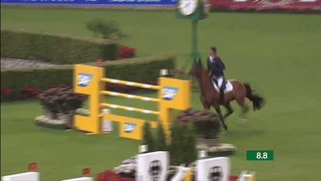
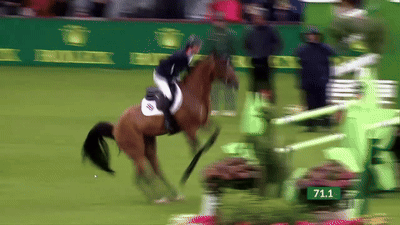
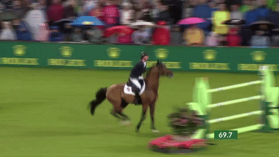
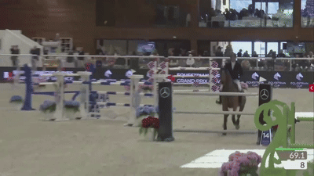
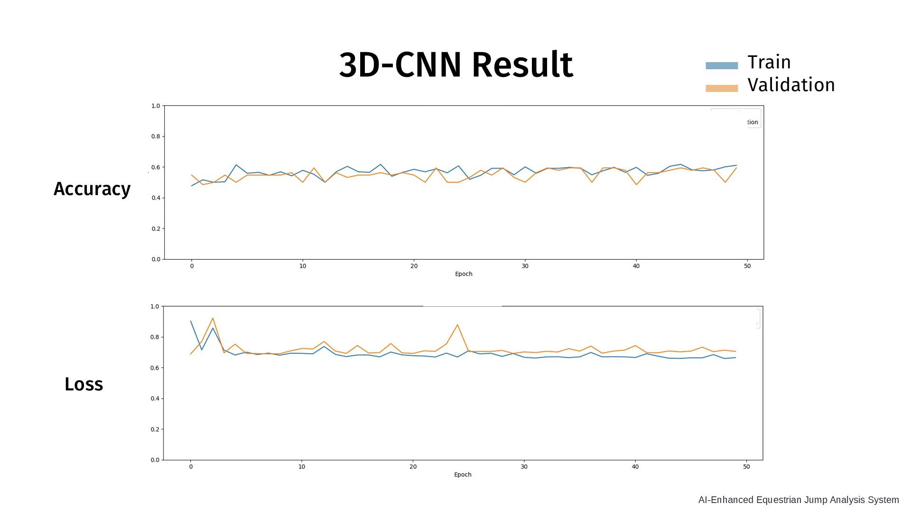
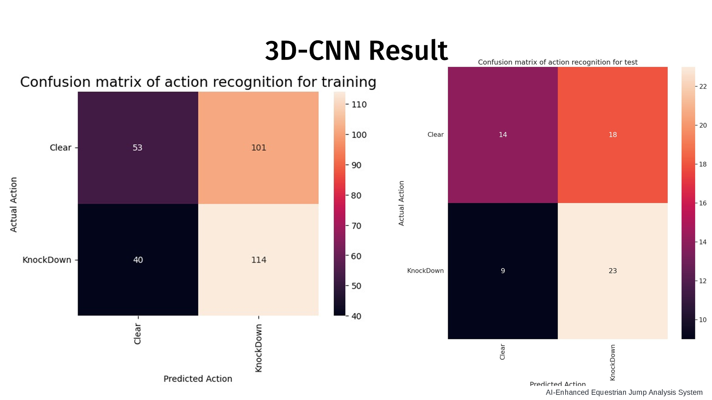
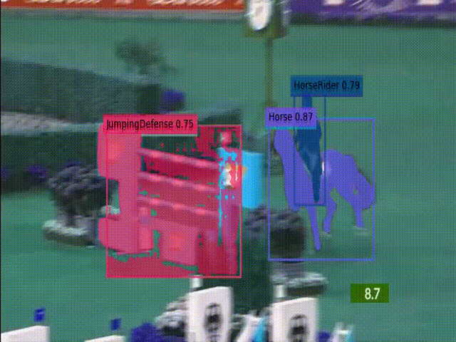

# 🐴 AI-Enhanced Equestrian Jump Analysis System

<div align="center">

[](https://www.python.org/)
[](https://www.tensorflow.org/)
[](https://pytorch.org/)
[](LICENSE)
[]()

**Automated video analysis system for equestrian jump performance evaluation using state-of-the-art deep learning models**

🏆 **Winner of Best Student Project Award - AI Festival 2024, Sheffield Hallam University**



</div>

---

## 📋 Table of Contents

- [Overview](#-overview)
- [Features](#-features)
- [System Architecture](#-system-architecture)
- [Technologies & Models](#-technologies--models)
- [Installation](#-installation)
- [Usage](#-usage)
- [Project Structure](#-project-structure)
- [Dataset](#-dataset)
- [Model Details](#-model-details)
- [Future Work](#-future-work)
- [Configuration](#-configuration)
- [Contributing](#-contributing)
- [Author](#-author)
- [License](#-license)
- [Acknowledgments](#-acknowledgments)
- [Contact](#-contact)

---

## 🎯 Overview

The **AI-Enhanced Equestrian Jump Analysis System** is an advanced computer vision and machine learning solution designed to automate the analysis of equestrian jumping videos. The system leverages multiple deep learning architectures to classify jump outcomes (Clear vs. Knock Down) and perform object detection and segmentation of key elements including horses, riders, and obstacles.

This project was developed in collaboration with **British Equestrian** and **Sheffield Hallam University**, aiming to revolutionize training and performance evaluation in equestrian sports through automated video analysis.

<div align="center">

### 🏆 **Award Winner**

**🏅 Best Student Project Award**  
*AI Festival 2024 - Sheffield Hallam University*

</div>


### Key Capabilities

- ✅ **Automated Jump Classification**: Binary classification of jump outcomes (Clear/Knock Down)
- ✅ **Object Detection & Segmentation**: Detection and segmentation of horses, riders, and obstacles
- ✅ **Video Preprocessing Pipeline**: Automated extraction and categorization of jump sequences
- ✅ **Multiple Model Architectures**: Implementation of various state-of-the-art deep learning models
- ✅ **Scalable Processing**: Support for batch processing of video datasets

---

## ✨ Features

### Core Functionality
- **Video Preprocessing**: Automated extraction of individual jump sequences from raw competition videos
- **Data Categorization**: Intelligent sorting of jumps into Clear, Knock Down, and Unidentified categories
- **Multi-Model Support**: Implementation of 8+ different deep learning architectures
- **Batch Processing**: Efficient processing of large video datasets

### Advanced Features
- **Temporal Analysis**: RNN-based models for capturing temporal dependencies in jump sequences
- **3D Convolutional Networks**: Spatiotemporal feature extraction using 3D CNNs
- **Action Recognition**: Leveraging MMAction2 and SlowFast for video action classification
- **Instance Segmentation**: YOLACT and YOLO-SAM integration for precise object segmentation

---

## 🏗️ System Architecture

<div align="center">
  
  <p><em>System Architecture Overview</em></p>
</div>


---

## 🛠️ Technologies & Models

### Deep Learning Frameworks
- **TensorFlow 2.10** - 3D CNN and CNN+RNN implementations
- **PyTorch** - MMAction2, SlowFast, Detectron2
- **Keras** - High-level neural network API

### Computer Vision Libraries
- **OpenCV** - Video processing and frame extraction
- **MMAction2** - Action recognition toolkit
- **Detectron2** - Object detection and segmentation
- **MediaPipe** - Pose estimation and hand tracking
- **YOLO** - Real-time object detection
- **SAM (Segment Anything Model)** - Advanced segmentation

### Data Processing
- **Pandas** - Data manipulation and CSV processing
- **NumPy** - Numerical computations
- **Roboflow** - Dataset management and preprocessing

### Cloud & Infrastructure
- **Azure** - Scalable cloud computing resources
- **Google Colab** - Development and experimentation environment

---

## 📦 Installation

### Prerequisites

- Python 3.8 or higher
- CUDA-capable GPU (recommended for training)
- Git

### Step 1: Clone the Repository

```bash
git clone https://github.com/Siavash-Mortaz/british_equestrian.git
cd british_equestrian
```

### Step 2: Create Virtual Environment

```bash
# Using conda (recommended)
conda create --name equestrian python=3.8 -y
conda activate equestrian

# Or using venv
python -m venv venv
source venv/bin/activate  # On Windows: venv\Scripts\activate
```

### Step 3: Install Dependencies

#### Basic Installation

```bash
pip install -r requirements.txt
```

#### For MMAction2 (Optional)

```bash
# Install OpenMMLab packages
pip install -U openmim
mim install mmengine mmcv mmdet mmpose

# Install MMAction2
cd ai_models/MMAction2
pip install -v -e .
cd ../..
```

#### For SlowFast (Optional)

```bash
cd ai_models/SlowFast
python setup.py build develop
cd ../..
```

### Step 4: Verify Installation

```bash
python -c "import tensorflow as tf; print(tf.__version__)"
python -c "import torch; print(torch.__version__)"
```

---

## 🚀 Usage

### 1. Data Preparation

Place your raw videos and corresponding CSV files in the appropriate directories:

```
dataset/
├── Raw_videos/          # Place raw competition videos here
└── Raw_csv/            # Place CSV metadata files here
```

**CSV Format**: Each CSV file should contain columns:
- `Position`: Jump start time in milliseconds
- `Duration`: Jump duration in milliseconds
- `Jump Outcome`: "Clear" or "Knock Down"

### 2. Video Preprocessing

Run the batch preprocessing script to extract and categorize jump sequences:

```bash
python preprocessor/batchvideopreprocess.py
```

**Output**: Processed videos will be saved in:
- `dataset/Data/clear/` - Successful jumps
- `dataset/Data/unclear/` - Failed jumps (knockdowns)
- `dataset/Data/Unidentified/` - Unclassified sequences

### 3. Model Training

#### CNN + RNN Model

```bash
cd ai_models/CNN_RNN
python video_classifier_working.py
```

#### 3D-CNN Model

```bash
cd ai_models/3DCNN
# Open and run video_classification.ipynb in Jupyter
```

#### MMAction2

```bash
cd ai_models/MMAction2
# Follow MMAction2_Installation_Instructions.txt
# Configure training scripts in tools/train.py
```

#### YOLO + SAM (Object Detection & Segmentation)

```bash
cd ai_models/Yolo_SAM
# Open and run train_yolov9_horse_fence_rider (2).ipynb
```

### 4. Data Scraping (Optional)

To scrape videos from Dartfish.tv:

```bash
cd dataset/Selenium
# Update credentials in scraper.py
python scraper.py
```

---

## 📁 Project Structure

```
british_equestrian/
│
├── ai_models/                    # Deep learning model implementations
│   ├── 3DCNN/                    # 3D Convolutional Neural Network
│   │   └── video_classification.ipynb
│   ├── CNN_RNN/                  # CNN + RNN hybrid model
│   │   ├── video_classifier_working.py
│   │   ├── train.csv
│   │   └── test.csv
│   ├── Detectron2/               # Object detection and segmentation
│   │   └── Train_Detectron2_Segmentation_on_Custom_Data.ipynb
│   ├── MediaPipe/                # Pose estimation
│   │   ├── hand_fingers.py
│   │   └── finger_volum.py
│   ├── MMAction2/                # Action recognition framework
│   │   ├── configs/              # Model configurations
│   │   ├── data/                 # Training/validation data
│   │   ├── tools/                # Training and testing scripts
│   │   └── mmaction/             # Core library
│   ├── SlowFast/                 # SlowFast action recognition
│   │   ├── configs/              # Model configurations
│   │   └── slowfast/             # Core library
│   ├── Yolact/                   # Real-time instance segmentation
│   │   ├── train.py
│   │   └── eval.py
│   └── Yolo_SAM/                 # YOLO + Segment Anything Model
│       └── train_yolov9_horse_fence_rider (2).ipynb
│
├── dataset/                      # Dataset management
│   ├── Data/                     # Processed data
│   │   ├── clear/                # Successful jumps
│   │   └── unclear/             # Failed jumps
│   ├── Raw_csv/                  # Raw CSV metadata files
│   ├── Raw_videos/               # Raw competition videos
│   ├── Selenium/                 # Web scraping tools
│   │   └── scraper.py
│   ├── videoPreprocess.ipynb     # Video preprocessing notebook
│   └── videopreprocess.py        # Video preprocessing script
│
├── preprocessor/                 # Data preprocessing pipeline
│   ├── batchVideoPreprocess.ipynb
│   ├── batchvideopreprocess.py
│   └── ReadMe
│
├── docs/                         # Project documentation
│   ├── Group3.pdf
│   ├── AI-Enhanced Equestrian Jump Analysis System_2.pdf
│   └── Siavash Mortaz Hejri_Individual Report_with refrence.pdf
│
└── README.md                     # This file
```

---

## 📊 Dataset

### Data Sources

- **British Equestrian**: Primary collaboration partner providing competition videos
- **Dartfish.tv**: Competition video platform (scraped using Selenium)

### Dataset Structure

The preprocessing pipeline generates categorized datasets:

- **Clear Jumps**: Successfully completed jumps without knockdowns
- **Knock Down Jumps**: Jumps where obstacles were knocked down
- **Unidentified**: Sequences that don't fit clear categories (potential stride analysis)

<div align="center">
  <table>
    <tr>
      <td align="center">
        
        <br><em>Clear Jump Example 1</em>
      </td>
      <td align="center">
        
        <br><em>Clear Jump Example 2</em>
      </td>
    </tr>
    <tr>
      <td align="center">
        
        <br><em>Knock Down Jump Example 1</em>
      </td>
      <td align="center">
        
        <br><em>Knock Down Jump Example 2</em>
      </td>
    </tr>
  </table>
</div>

### Open Source Datasets

For YOLO model training, the following datasets are recommended:

1. **Fence Hurdles Detection**
   - URL: https://universe.roboflow.com/equestrian-ai/fence-hurdles-detection
   - Note: May cause errors with YOLOv9

2. **Horse Segmentation**
   - URL: https://universe.roboflow.com/equiai/horse_seg-6hrhn

---

## 🤖 Model Details

### 1. CNN + RNN
- **Architecture**: InceptionV3 (feature extraction) + RNN (temporal modeling)
- **Purpose**: Video classification using spatial and temporal features
- **Input**: Video frames (resized and normalized)
- **Output**: Binary classification (Clear/Knock Down)


### 2. 3D-CNN
- **Architecture**: ResNet-based 3D Convolutional Network
- **Purpose**: Spatiotemporal feature extraction
- **Key Feature**: FrameGenerator class for efficient data pipeline
- **Advantage**: Residual blocks prevent vanishing gradients

<div align="center">
  <table>
    <tr>
      <td align="center">
        
        <br><em>3D-CNN Model Performance Metrics 1</em>
      </td>
      <td align="center">
        
        <br><em>3D-CNN Model Performance Metrics 2</em>
      </td>
    </tr>
  </table>
</div>


### 3. MMAction2
- **Framework**: OpenMMLab's action recognition toolkit
- **Models**: TSN, SlowFast, I3D, and more
- **Purpose**: State-of-the-art action recognition
- **Configuration**: Custom configs for equestrian jump classification

### 4. SlowFast
- **Architecture**: Dual-pathway network (slow + fast streams)
- **Purpose**: Capturing both spatial details and temporal dynamics
- **Application**: High-performance action recognition

### 5. YOLO + SAM
- **YOLO**: Real-time object detection (horse, rider, fence)
- **SAM**: Advanced segmentation for precise mask generation
- **Purpose**: Object detection and instance segmentation

<div align="center">
  <table>
    <tr>
      <td align="center">
        
        <br><em>Object Detection Results</em>
      </td>
      <td align="center">
        
        <br><em>Instance Segmentation Results</em>
      </td>
    </tr>
  </table>
</div>

### 6. Detectron2
- **Framework**: Facebook's object detection library
- **Purpose**: Custom segmentation training on equestrian data
- **Application**: Instance segmentation of horses, riders, and obstacles

### 7. YOLACT
- **Architecture**: Real-time instance segmentation
- **Purpose**: Fast and accurate segmentation without two-stage detection

### 8. MediaPipe
- **Purpose**: Pose estimation and hand tracking
- **Application**: Potential for rider posture analysis

<div align="center">
  
  <p><em>MediaPipe exercise</em></p>
</div>

---

## 🔮 Future Work

The following enhancements and research directions are planned for future development of the AI-Enhanced Equestrian Jump Analysis System:

### Model Improvements

- **Ensemble Methods**: Combine predictions from multiple models (CNN+RNN, 3D-CNN, MMAction2) to improve classification accuracy and robustness
- **Transformer-Based Models**: Explore Vision Transformers (ViT) and Video Transformers for better temporal understanding
- **Self-Supervised Learning**: Implement contrastive learning and temporal consistency methods to leverage unlabeled data
- **Model Compression**: Develop lightweight models for real-time inference on mobile devices and edge computing platforms

### Advanced Analysis Features

- **Stride Analysis**: Implement automatic stride counting and analysis for approach phases
- **Jump Height Measurement**: Develop computer vision techniques to measure jump height and clearance
- **Rider Posture Analysis**: Integrate pose estimation to analyze rider position and form during jumps
- **Multi-Jump Sequence Analysis**: Extend the system to analyze entire courses with multiple jumps
- **Real-time Performance Metrics**: Calculate speed, trajectory, and timing metrics during live competitions

### Dataset Expansion

- **Diverse Conditions**: Collect and annotate data from various lighting conditions, weather, and camera angles
- **Multi-Class Classification**: Expand beyond binary classification to include fault types (refusals, run-outs, time faults)
- **Cross-Discipline Training**: Include data from different equestrian disciplines (show jumping, eventing, cross-country)
- **Synthetic Data Generation**: Use GANs or data augmentation techniques to generate synthetic training data

### System Integration

- **Web Application**: Develop a user-friendly web interface for trainers and judges to upload videos and receive analysis
- **Mobile App**: Create iOS and Android applications for on-the-go video analysis
- **API Development**: Build RESTful APIs for integration with existing equestrian management systems
- **Cloud Deployment**: Deploy models on cloud platforms (AWS, Azure, GCP) for scalable inference

### Real-World Applications

- **Training Feedback System**: Provide real-time feedback to riders and trainers during practice sessions
- **Competition Analysis**: Integrate with competition management systems for automated scoring assistance
- **Injury Prevention**: Develop predictive models to identify potential injury risks based on jump technique
- **Performance Tracking**: Create longitudinal tracking systems to monitor rider and horse improvement over time

### Technical Enhancements

- **Explainable AI**: Implement attention mechanisms and visualization tools to explain model predictions
- **Active Learning**: Develop systems that intelligently select which videos to annotate next
- **Federated Learning**: Enable training across multiple institutions while preserving data privacy
- **Edge Computing**: Optimize models for deployment on edge devices at competition venues


<div align="center">
  <table>
    <tr>
      <td align="center">
        
        <br><em>OmniMotion: Tracking Everything Everywhere All at Once (2023)</em>
      </td>
      <td align="center">
        
        <br><em>FeatUp: A Model-Agnostic Framework for Features at Any Resolution (2024)</em>
      </td>
    </tr>
  </table>
  <p><em>Future Work Roadmap</em></p>
</div>

---

## 🔧 Configuration

### Preprocessing Settings

Edit `preprocessor/batchvideopreprocess.py` to customize:

- Video chunk duration (default: 1750ms)
- Start time offset (default: 500ms before jump)
- Output video format and quality
- Directory paths for input/output

### Model Training

Each model directory contains configuration files:

- **MMAction2**: Edit configs in `ai_models/MMAction2/configs/`
- **SlowFast**: Modify YAML files in `ai_models/SlowFast/configs/`
- **3D-CNN/CNN+RNN**: Adjust hyperparameters in respective Python scripts

---

## 🤝 Contributing

Contributions are welcome! Please follow these steps:

1. Fork the repository
2. Create a feature branch (`git checkout -b feature/AmazingFeature`)
3. Commit your changes (`git commit -m 'Add some AmazingFeature'`)
4. Push to the branch (`git push origin feature/AmazingFeature`)
5. Open a Pull Request

### Development Guidelines

- Follow PEP 8 style guide for Python code
- Add docstrings to functions and classes
- Include unit tests for new features
- Update documentation as needed

---

## 👤 Author

**Siavash Mortaz Hejri**

- GitHub: [@Siavash-Mortaz](https://github.com/Siavash-Mortaz)
- Project: [british_equestrian](https://github.com/Siavash-Mortaz/british_equestrian)

### Project Background

This project was developed as part of the **AI Research And Development Projects (R&D)** module for the **MSc in Artificial Intelligence** program at **Sheffield Hallam University**.

### Achievements

- 🏆 **Best Student Project Award** - AI Festival 2024, Sheffield Hallam University
- ⭐ **Distinction Grade** - AI Research And Development Projects (R&D) Module

---

## 📄 License

This project is licensed under the MIT License - see the [LICENSE](LICENSE) file for details.

---

## 🙏 Acknowledgments

### Organizations
- **British Equestrian** - For collaboration and data provision
- **Sheffield Hallam University** - For academic support and guidance

### Academic Supervisors & Instructors
- **Dr Alejandro Jiménez Rodríguez** - Project Supervisor, Sheffield Hallam University
- **Dr Maria Luisa Davila Garcia** - Course Instructor for Machine Learning and Computer Vision, Sheffield Hallam University

### Open Source Projects
- [MMAction2](https://github.com/open-mmlab/mmaction2) - Action recognition framework
- [SlowFast](https://github.com/facebookresearch/SlowFast) - Video understanding models
- [Detectron2](https://github.com/facebookresearch/detectron2) - Object detection library
- [YOLO](https://github.com/ultralytics/ultralytics) - Real-time object detection
- [Segment Anything Model (SAM)](https://github.com/facebookresearch/segment-anything) - Advanced segmentation

### Contributors
- All team members who contributed to the development and refinement of this system

---

## 📧 Contact

For questions, suggestions, or collaborations, please open an issue on GitHub or contact the project maintainers.

---

<div align="center">

**Made with ❤️ for the Equestrian Community**

[⬆ Back to Top](#-ai-enhanced-equestrian-jump-analysis-system)

</div>
